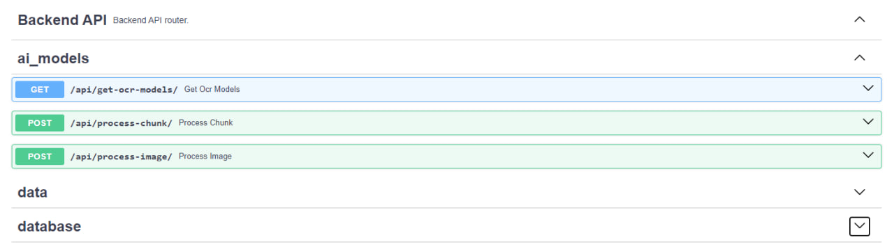
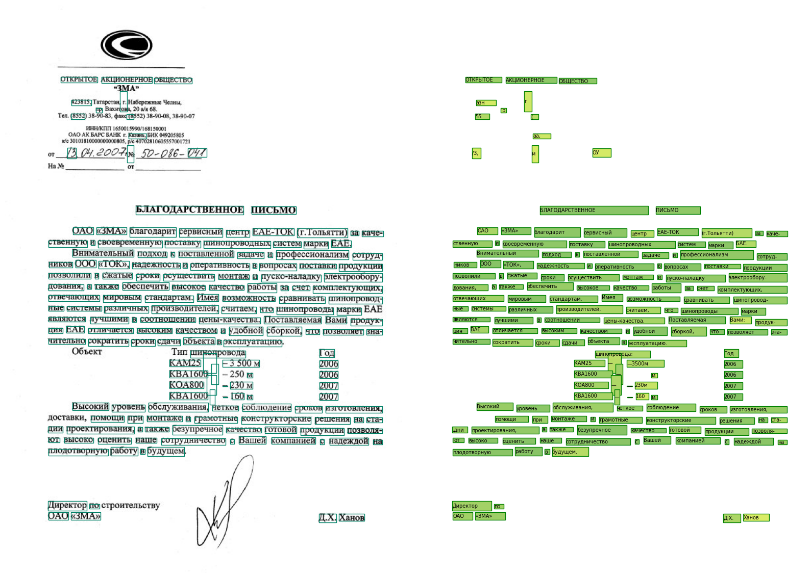

TatneftIT 
==============================

Implementation of OCR from open sources for internal tasks of the Tatneft Group.

Project Organization
------------

    ├── LICENSE
    ├── Makefile                <- Makefile with commands like `make data` or `make train`
    ├── README.md               <- The top-level README for developers using this project.
    │
    ├── docs                    <- A default Sphinx project; see sphinx-doc.org for details
    │
    ├── models                  <- Trained and serialized models, model predictions, or model summaries
    │
    ├── notebooks               <- Jupyter notebooks. Example of the model usage.
    │
    ├── requirements.txt 
    │
    ├── setup.py                <- makes project pip installable (pip install -e .) so src can be imported
    ├── src                     <- Source code for use in this project.
    │   ├── api                 
    │   │   ├── services        <- Fast API services.
    │   │   ├── models          <- Fast API models.
    │   │   └── main.py
    │   │
    │   ├── db                  <- Scripts that using for connect to the database, 'processed' table manager.
    │   │   ├── database_manager.py
    │   │   ├── processed_structure.py
    │   │   └── processed_manager.py
    │   │
    │   │
    │   ├── features            <- Scripts to turn raw data into features for modeling
    │   │   └── build_features.py
    │   │
    │   ├── models              <- Scripts with loading trained models.
    │   │   ├── ocr             <- Factory Method pattern.
    │   │   |   ├── ocr.py      
    │   │   |   ├── mmocr.py    
    │   │   |   ├── easyocr.py  
    │   │   |   └── pytesseract.py 
    │   │   |   
    │   │   └── zero_shot_classification.py
    │   │
    │   └── visualization       <- Scripts to create exploratory and results oriented visualizations
    │       └── visualize.py
    │
    ├── tests                   <- Unittest for each class in src. 
    │   └── ...
    │
    └── tox.ini                 <- tox file with settings for running tox; see tox.readthedocs.io


--------
## Run project
#### Building Docker Image
It is preferable to run the project on the linux
```bash
 docker build -t carrot-ocr . --no-cache  2>&1 | tee build_log.txt
```
#### Hosting Docker Image
In progress...
## FastAPI Swagger
Now you can open locally this site http://127.0.0.1:8000/docs.


## Example of usage

```python
import mmcv
from src.visualization.visualize import *
from src.models.ocr.ocr import OCRModelFactory

url = 'data/raw/example1.jpg'
image = mmcv.imread(url)

model = OCRModelFactory.create("pytesseract")
outputs = model([image])
result2show(image, outputs[0])
```

